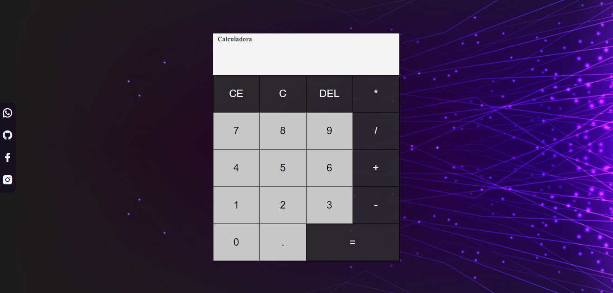

# Calculadora
> Desenvolvido por Carlos Eduardo
* Este é um projeto de calculadora simples criado usando HTML, CSS e JavaScript puro.

# 📷 Captura de Tela


# 🚀 Tecnologias

* HTML
* CSS
* Javascript

# ⚙️ Funcionalidades

* A calculadora permite que você realize operações aritméticas básicas, como adição, subtração, multiplicação e divisão.

# 🌱 Instalação

* Para usar esta calculadora, basta baixar ou clonar o projeto do GitHub e abrir o arquivo index.html em seu navegador da web.

```
git clone https://github.com/Carlos-Eduardo5Qs/Calculator.git
```
# 🏃‍♂️ Uso

* Para usar a calculadora, basta clicar nos botões numéricos e de operação para inserir a equação que você deseja calcular. Em seguida, clique no botão "igual" para obter o resultado. Para limpar o visor, basta clicar no botão "C".

# 🧱 Contribuição
* Sinta-se à vontade para contribuir com este projeto enviando pull requests ou relatórios de problemas.
